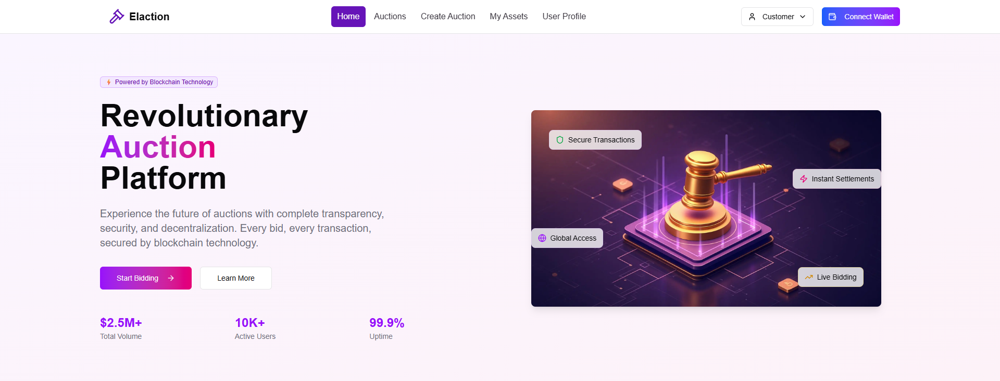
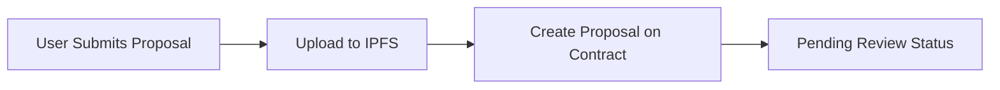
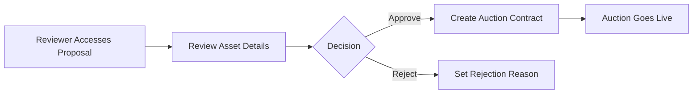
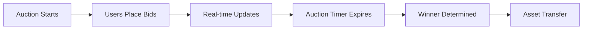

# �️ Dev-Elaction - Decentralized Real Estate Auction Platform

<h4 align="center">
  <a href="#features">Features</a> |
  <a href="#quick-start">Quick Start</a> |
  <a href="#architecture">Architecture</a> |
  <a href="#api-documentation">API</a>
</h4>

🏗️ A comprehensive decentralized auction platform for real estate assets built on Ethereum blockchain. This platform enables secure, transparent, and efficient real estate auctions with integrated review systems, role-based access control, and comprehensive asset management.

⚙️ Built using NextJS, XellarKit, Hardhat, Wagmi, Viem, TypeScript, Shadcn/ui and Tailwind CSS.

## 🌟 Key Features

- 🏠 **Real Estate Asset Auctions**: Complete auction lifecycle management for real estate properties
- 👥 **Role-Based Access Control**: Admin, Reviewer, and User roles with specific permissions
- 📋 **Proposal Review System**: Administrative review process before assets go to auction
- 💰 **IDRX Token Integration**: Custom ERC-20 token for bidding and transactions
- 🔄 **Real-Time Bidding**: Live auction updates with automatic countdown timers
- 📊 **Comprehensive Analytics**: User portfolios, auction statistics, and financial tracking
- �️ **IPFS Asset Storage**: Decentralized storage for asset metadata and images
- � **Responsive Design**: Mobile-first design with modern UI/UX
- 🔐 **Wallet Integration**: Support for multiple wallet providers
- ⚡ **Real-Time Updates**: Live auction state synchronization



## 📋 Requirements

Before you begin, you need to install the following tools:

- [Node.js (>= v20.18.3)](https://nodejs.org/en/download/)
- [Yarn (v1 or v2+)](https://classic.yarnpkg.com/en/docs/install/)
- [Git](https://git-scm.com/downloads)
- [MetaMask](https://metamask.io/) or other Web3 wallet

## 🚀 Quick Start

To get started with Dev-Elaction, follow these steps:

### 1. Clone and Install Dependencies

```bash
git clone https://github.com/Bykamri/dev-elaction.git
cd dev-elaction
yarn install
```

### 2. Start Local Blockchain Network

```bash
yarn chain
```

This starts a local Ethereum network using Hardhat for development and testing.

### 3. Deploy Smart Contracts

```bash
yarn deploy
```

This deploys the following contracts:
- **RwaNft**: ERC-721 contract for real estate asset tokens
- **AuctionFactory**: Factory contract for creating and managing auctions
- **MockIDRX**: ERC-20 token contract for bidding (IDRX tokens)

### 4. Start the Frontend Application

```bash
yarn start
```

Visit your application at: `http://localhost:3000`

### 5. Configure Your Wallet

- Add the local network to your wallet (Chain ID: 31337)
- Import one of the test accounts from Hardhat
- You're ready to start testing the auction platform!

## 🏗️ Architecture

### Smart Contracts

#### Core Contracts

1. **AuctionFactory.sol**
   - Creates and manages individual auction contracts
   - Handles proposal submissions and review workflow
   - Manages role-based access control (Admin, Reviewer roles)
   - Tracks all proposals and their states

2. **Auction.sol**
   - Individual auction contract for each asset
   - Handles bidding logic and auction lifecycle
   - Manages bid history and winner determination
   - Integrates with IDRX token for payments

3. **RwaNft.sol**
   - ERC-721 contract for real estate asset tokens
   - Stores asset metadata and ownership
   - Integrates with IPFS for decentralized storage

4. **MockIDRX.sol**
   - ERC-20 token contract for platform currency
   - Used for bidding and auction payments
   - Includes minting functionality for testing

### Frontend Architecture

#### Tech Stack
- **Framework**: Next.js 14 with App Router
- **Blockchain Integration**: Wagmi + Viem
- **Wallet Connection**: XellarKit
- **UI Framework**: Tailwind CSS + shadcn/ui
- **State Management**: React Hooks + Context API
- **File Storage**: IPFS via Pinata

#### Key Components

1. **Custom Hooks** (`packages/nextjs/hooks/`)
   - `useAuctionDetails`: Complete auction management with real-time bidding
   - `useWalletBalance`: ETH and IDRX balance tracking
   - `useAdminRole`: Role-based access control
   - `useAssetsData`: User portfolio and auction history
   - `useUserProfile`: Comprehensive user statistics
   - `useProposalData`: Proposal data and metadata management

2. **UI Components** (`packages/nextjs/components/`)
   - **Admin Panel**: Role management and proposal review
   - **Customer Interface**: Auction browsing and bidding
   - **Auth Guards**: Wallet connection and role verification
   - **Asset Cards**: Property display with comprehensive information
   - **Transaction Management**: Bid placement and approval handling

3. **Page Structure**
   - `/` - Homepage with featured auctions
   - `/auctions` - Browse all active auctions
   - `/auctions/[id]` - Individual auction details and bidding
   - `/admin` - Administrative dashboard
   - `/customer` - User dashboard and profile
   - `/api` - Backend API endpoints

## 🎯 User Roles & Permissions

### 👤 Regular Users
- Browse and search auctions
- Place bids on active auctions
- View bid history and auction details
- Manage personal profile and transaction history
- Submit new asset proposals for review

### 👨‍💼 Reviewers
- Review submitted asset proposals
- Approve or reject proposals with comments
- Access reviewer dashboard
- View proposal details and metadata

### 👨‍💻 Administrators
- Full platform management access
- User role assignment and management
- System configuration and monitoring
- Access to all platform statistics
- Emergency controls and maintenance

## 🔄 Auction Workflow

### 1. Asset Proposal Submission


### 2. Review Process


### 3. Auction Lifecycle


## 🛠️ Development

### Project Structure

```
dev-elaction/
├── packages/
│   ├── hardhat/           # Smart contracts and deployment
│   │   ├── contracts/     # Solidity contracts
│   │   ├── deploy/        # Deployment scripts
│   │   └── test/          # Contract tests
│   └── nextjs/            # Frontend application
│       ├── app/           # Next.js app router pages
│       ├── components/    # React components
│       ├── hooks/         # Custom React hooks
│       ├── lib/           # Utility functions
│       └── types/         # TypeScript type definitions
```

### Available Scripts

```bash
# Development
yarn chain          # Start local blockchain
yarn deploy         # Deploy contracts
yarn start          # Start frontend
yarn dev            # Start in development mode

# Testing
yarn test           # Run all tests
yarn hardhat:test   # Run contract tests
yarn lint           # Run ESLint
yarn type-check     # TypeScript type checking

# Production
yarn build          # Build for production
yarn preview        # Preview production build
```

### Environment Configuration

Create a `.env.local` file in `packages/nextjs/`:

```env
NEXT_PUBLIC_PINATA_GATEWAY=https://gateway.pinata.cloud
PINATA_API_KEY=your_pinata_api_key
PINATA_SECRET_API_KEY=your_pinata_secret
NEXT_PUBLIC_WALLET_CONNECT_PROJECT_ID=your_wallet_connect_id
```


## 🚀 Deployment

### Local Development
Already covered in Quick Start section.

### Testnet Deployment

1. **Configure Network**
   Update `packages/hardhat/hardhat.config.ts` with testnet configuration:

```typescript
networks: {
  liskSepolia: {
    url: "https://rpc.sepolia-api.lisk.com",
    accounts: [process.env.DEPLOYER_PRIVATE_KEY],
  }
}
```

2. **Deploy Contracts**
```bash
yarn deploy --network localhost
```

3. **Update Frontend Configuration**
   Update contract addresses in `packages/nextjs/contracts/deployedContracts.ts`

### Production Deployment

1. **Frontend Deployment** (Vercel recommended)
```bash
yarn build
# Deploy to your preferred platform
```

2. **Configure Environment Variables**
   Set all required environment variables in your deployment platform.

## 📚 API Documentation

### Smart Contract Events

#### AuctionFactory Events
- `ProposalSubmitted(uint256 proposalId, address proposer)`
- `ProposalReviewed(uint256 proposalId, bool approved)`
- `AuctionCreated(uint256 proposalId, address auctionContract)`

#### Auction Events
- `Bid(address bidder, uint256 amount)`
- `AuctionEnded(address winner, uint256 winningBid)`

### Custom Hooks API

#### useAuctionDetails(auctionAddress)
```typescript
const {
  auction,           // Complete auction data
  allowance,         // Token allowance
  isLoading,         // Loading state
  timeLeft,          // Countdown timer
  isFinished,        // Auction status
  handleApprove,     // Approve tokens
  handleBid          // Place bid
} = useAuctionDetails(auctionAddress);
```

#### useWalletBalance()
```typescript
const {
  ethBalance,        // ETH balance
  idrxBalance,       // IDRX balance
  isLoading,         // Loading state
  error,             // Error state
  refreshBalances    // Manual refresh
} = useWalletBalance();
```

## 🔐 Security Considerations

### Smart Contract Security
- **Access Control**: Role-based permissions using OpenZeppelin
- **Reentrancy Protection**: ReentrancyGuard implementation
- **Integer Overflow**: SafeMath operations
- **Input Validation**: Comprehensive parameter checking

### Frontend Security
- **Wallet Integration**: Secure wallet connection handling
- **Transaction Simulation**: Pre-execution validation
- **Error Handling**: Graceful failure management
- **Data Validation**: Input sanitization and validation

## 🤝 Contributing

We welcome contributions to Dev-Elaction! Please follow these steps:

1. **Fork the Repository**
2. **Create a Feature Branch**
   ```bash
   git checkout -b feature/your-feature-name
   ```
3. **Make Your Changes**
   - Follow the existing code style
   - Add tests for new functionality
   - Update documentation as needed
4. **Submit a Pull Request**

### Development Guidelines

- **Code Style**: Follow ESLint and Prettier configurations
- **Commit Messages**: Use conventional commit format
- **Testing**: Ensure all tests pass before submitting
- **Documentation**: Update relevant documentation

## 📄 License

This project is licensed under the MIT License - see the [LICENSE](LICENSE) file for details.

## 🙏 Acknowledgments

- Built on [Scaffold-ETH 2](https://scaffoldeth.io)
- Powered by [OpenZeppelin](https://openzeppelin.com) contracts
- UI components from [shadcn/ui](https://ui.shadcn.com)
- Decentralized storage via [IPFS](https://ipfs.io)


